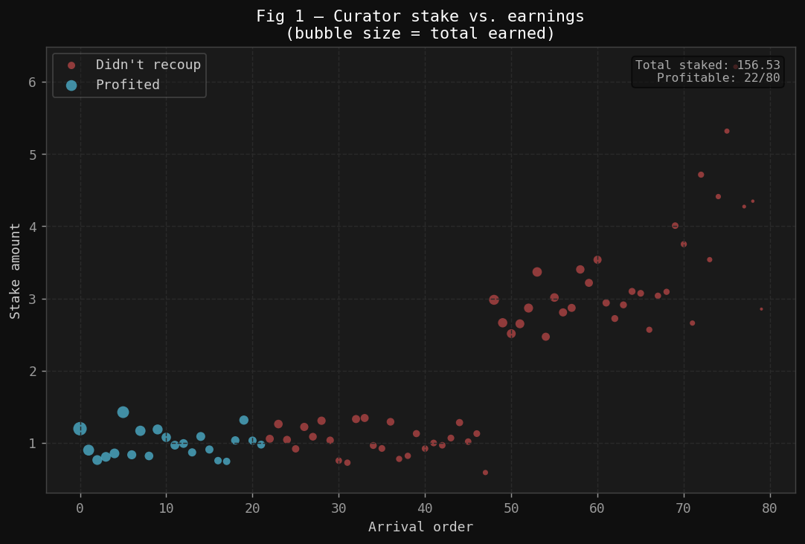
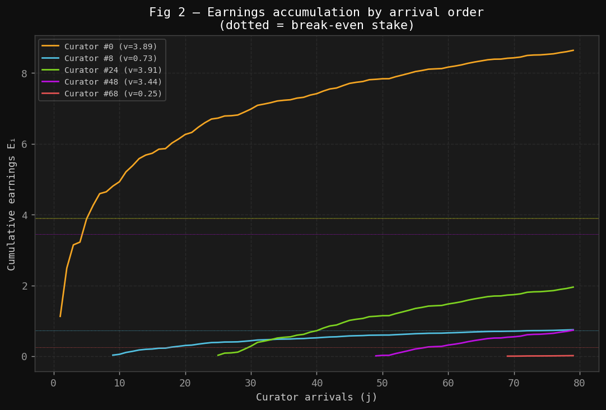
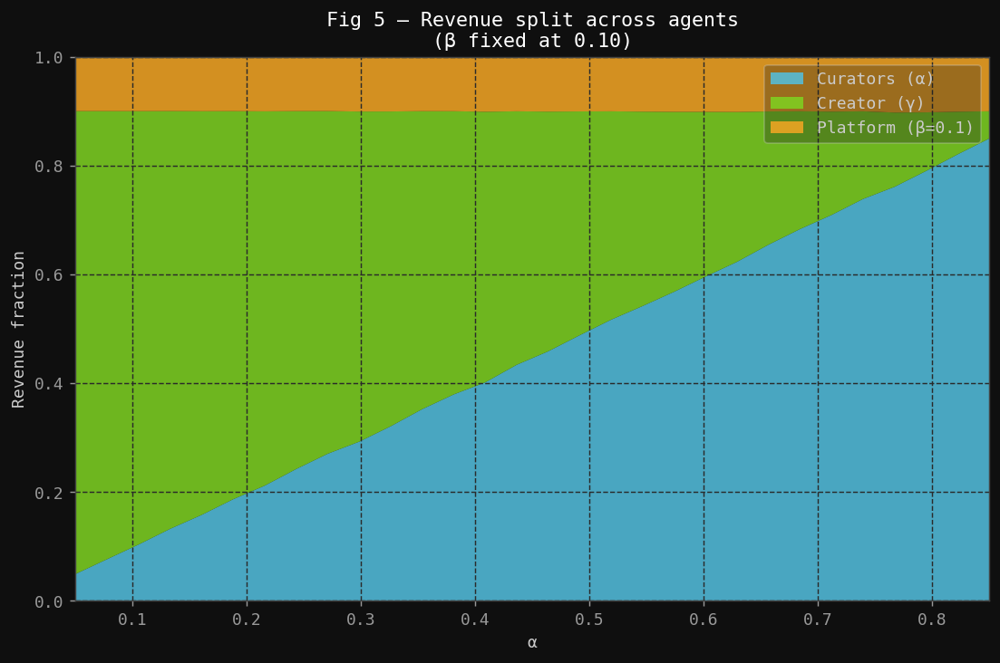
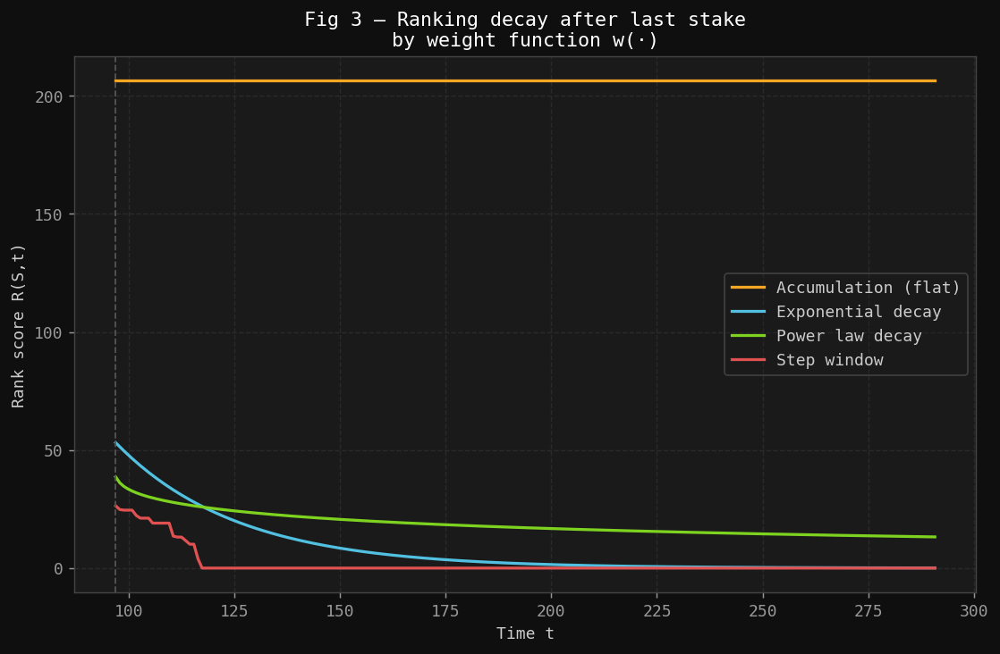
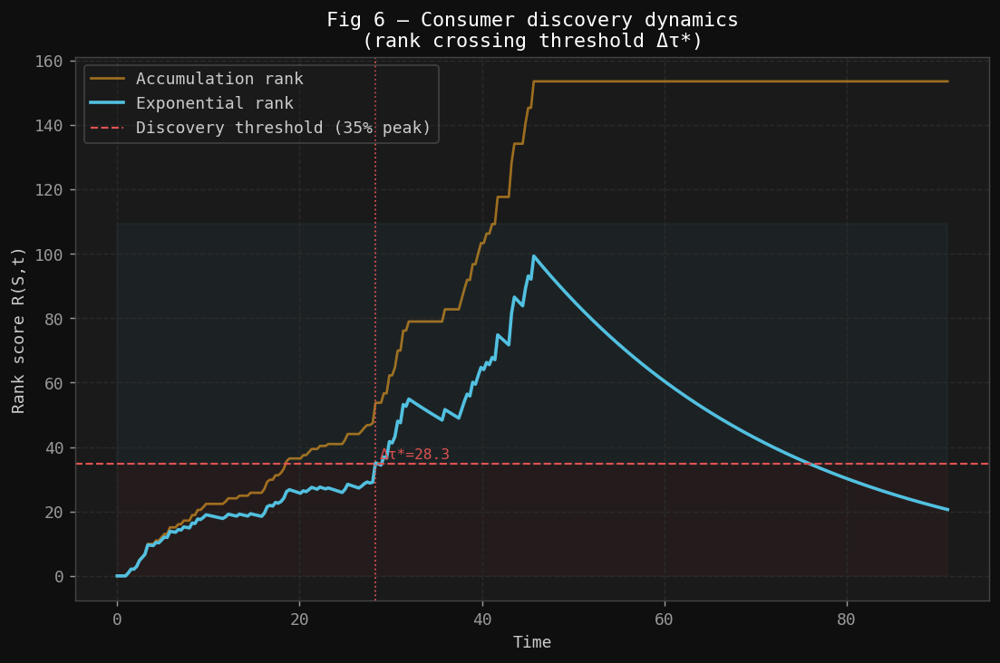
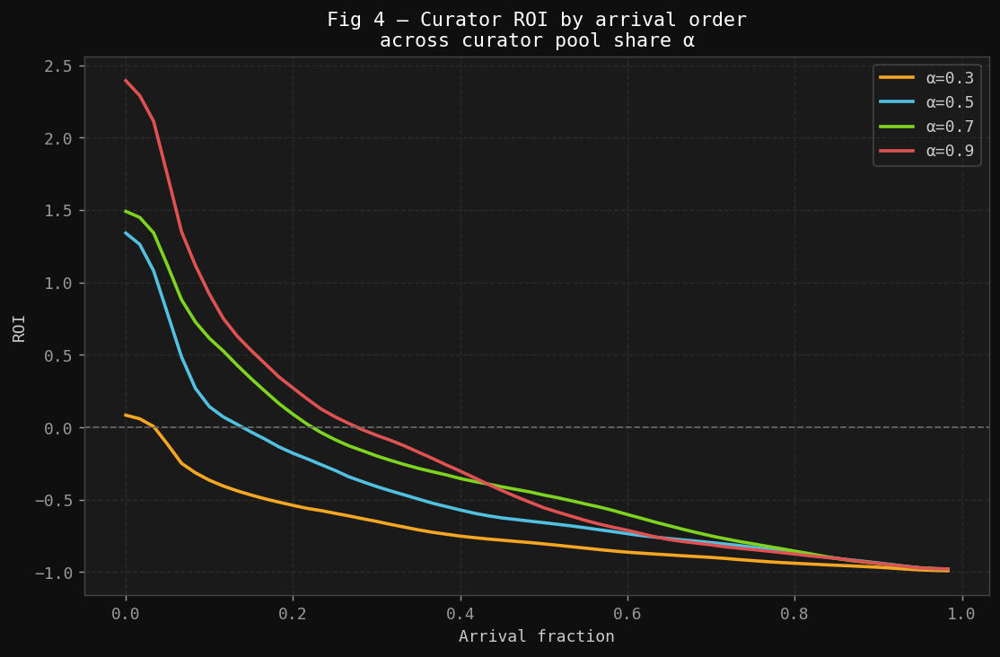

# A Generalized Model of Community Curation Pipelines
**Formal Specification v1.0**
*Corey Petty*

---

## Table of Contents
1. [Motivation](#1-motivation)
2. [Primitives](#2-primitives)
3. [The Staking Game](#3-the-staking-game)
4. [Feed Mechanics](#4-feed-mechanics)
5. [Consumer Surplus](#5-consumer-surplus)
6. [Mechanism Quality Metrics](#6-mechanism-quality-metrics)
7. [Open Questions for Validation](#7-open-questions-for-validation)
8. [Proposed Research Plan](#8-proposed-research-plan)

---

## 1. Motivation

Social platforms face a fundamental coordination problem: content quality is unobservable at publication time, yet consumers need high-quality content to surface quickly. Traditional solutions — editorial curation, engagement algorithms, follower graphs — either centralize judgment or optimize for engagement proxies that diverge from quality.

This document formalizes a **community curation pipeline**: a market mechanism in which agents voluntarily stake resources on content signals, earning rewards proportional to their contribution and timing. Staking simultaneously (a) compensates early discovery and (b) produces a ranked feed that consumers rely on.

The model generalizes work originally done to describe the Cent/Yours Network payout system [[1]](#references), extending it to a 4-sided market with explicit feed mechanics, consumer surplus, and formal mechanism evaluation criteria.

---

## 2. Primitives

### 2.1 Signals

Let $\mathcal{S} = \{S_1, S_2, \ldots\}$ be the set of **signals** (content items, claims, proposals, or any community contribution) published to the platform.

Each signal $S \in \mathcal{S}$ is characterized by:
- $q(S) \in [0, 1]$ — **true quality**, a latent variable not directly observable at publication time
- $\tau(S) \in \mathbb{R}_{\geq 0}$ — **publication time**

### 2.2 Agents

| Role | Description | Action | Incentive |
|------|-------------|--------|-----------|
| **Creator** | Produces signal $S$ | Publish | Maximize downstream revenue |
| **Curator** | Evaluates and endorses $S$ | Stake $v_i$ at time $t_i$ | Earn from subsequent staking |
| **Consumer** | Discovers and consumes $S$ | Browse ranked feed | Minimize search cost; maximize quality |
| **Platform** | Coordinates the market | Rank feed; extract cut | Sustain operations |

Let $\mathcal{C}$, $\mathcal{K}$, $\mathcal{U}$, and $\mathcal{P}$ denote curators, creators, consumers, and the platform respectively. The platform is treated as the mechanism designer, not a strategic agent.

### 2.3 Stake Space

A **stake** is any scarce resource committed irrevocably to a signal. In the original Cent model this is currency; in the general case it may be tokens, reputation, attention, or votes. Stakes are assumed cardinal and summable.

---

## 3. The Staking Game

### 3.1 Setup

Fix a signal $S$. Curators arrive and stake sequentially. Let the ordered staking sequence be:

$$
(v_1, t_1),\ (v_2, t_2),\ \ldots,\ (v_n, t_n) \quad \text{with } t_1 < t_2 < \cdots < t_n
$$

where $v_i > 0$ is the stake of the $i$-th curator and $t_i$ is their arrival time.

**Definition (Cumulative Pool).** The cumulative pool just before curator $i$ arrives is:

$$
V_i^- = \sum_{k=1}^{i-1} v_k, \qquad V_1^- = 0
$$

The total pool after all $n$ curators have staked is $V_n = \sum_{k=1}^{n} v_k$.

**Definition (Proportional Share).** Curator $i$'s proportional share at the moment they stake is:

$$
s_i = \frac{v_i}{V_i^- + v_i} = \frac{v_i}{V_{i+1}^-}
$$

For $i = 1$, the first curator holds 100% of the pool at entry, but their share dilutes as subsequent curators arrive.

### 3.2 Payout Parameters

Let $\alpha, \beta \in (0,1)$ with $\alpha + \beta < 1$. Define:
- $\alpha$ — **curator pool share**: fraction of each new stake redistributed to prior curators
- $\beta$ — **platform share**: fraction taken by the platform
- $\gamma = 1 - \alpha - \beta$ — **creator share**: remainder going to the content creator

### 3.3 Payout Function

**Definition (Individual Payout).** When curator $j$ stakes $v_j$, the payout to prior curator $i < j$ is:

$$
\pi(i,j) = v_j \cdot \alpha \cdot \frac{v_i}{V_j^-}
$$

**Definition (Total Curator Earnings).** The total earnings of curator $i$ over the lifetime of signal $S$:

$$
E_i = \sum_{j=i+1}^{n} \pi(i,j) = \alpha \cdot v_i \sum_{j=i+1}^{n} \frac{v_j}{V_j^-}
$$

> **Key object:** The inner sum $\Phi_i = \sum_{j=i+1}^{n} \frac{v_j}{V_j^-}$ measures the *relative growth* of the pool after curator $i$ arrived. Earlier curators face a smaller denominator $V_j^-$ for each subsequent $j$, yielding a larger $\Phi_i$. This is the formal expression of the **first-mover advantage**. Figure 1 illustrates this empirically: under a mixed-normal stake distribution, early-arriving curators are overwhelmingly profitable regardless of stake size. Figure 2 shows the earnings accumulation trajectory for individual curators, making the contrast between early and late arrivals concrete.

*Figure 1: Each bubble is one curator. Size encodes total earnings; color encodes profitability. Curators who arrived early (low index) are predominantly blue regardless of stake size, confirming the first-mover advantage built into $E_i$.*

*Figure 2: Cumulative earnings $E_i$ over time for five representative curators (uniform stake distribution, α = 0.5). The earliest curator (orange) captures a large share of every subsequent stake; late-arriving curators barely cross break-even.*

### 3.4 Revenue by Role

The three-way split between curators, creator, and platform is governed by $\alpha$, $\beta$, and $\gamma$. Figure 5 sweeps $\alpha$ across the feasible range to show how this tradeoff plays out in practice.

**Platform revenue:**
$$\Pi_{\mathcal{P}} = \beta \cdot V_n$$

**Creator revenue:**
$$\Pi_{\mathcal{K}} = v_1(1 - \beta) + \sum_{j=2}^{n} v_j \cdot \gamma$$

(The first curator's stake flows entirely to the creator minus platform cut; subsequent stakes split three ways.)

**Total curator revenue:**
$$\Pi_{\mathcal{C}} = \alpha \cdot (V_n - v_1)$$

**Proposition (Conservation).** All stake is accounted for:
$$\Pi_{\mathcal{P}} + \Pi_{\mathcal{K}} + \Pi_{\mathcal{C}} = V_n$$

*Figure 5: Stacked revenue fractions across 30 values of α (β = 0.10 fixed). At α ≈ 0.45 curators and creator split the non-platform revenue roughly equally. Increasing α above ~0.7 begins to crowd out creator revenue substantially.*

---

## 4. Feed Mechanics

### 4.1 Ranking Function

**Definition (Rank Score).** The rank score of signal $S$ at time $t$ is:

$$
R(S, t) = \sum_{i:\, t_i \leq t} w(t - t_i) \cdot v_i
$$

where $w : \mathbb{R}_{\geq 0} \to \mathbb{R}_{> 0}$ is a **temporal weight function**.

The consumer feed at time $t$ is the ordered list of signals sorted by $R(S, t)$ descending. Feed position is a direct function of collective curator behavior.

### 4.2 Temporal Weight Functions

| Name | $w(\Delta t)$ | Behavior |
|------|--------------|----------|
| Accumulation | $1$ | Pure stake total; no recency bias |
| Exponential decay | $e^{-\lambda \Delta t}$ | Recent stakes dominate; $\lambda$ controls half-life |
| Power law | $(1 + \Delta t)^{-\theta}$ | Heavy-tailed; HN-style |
| Step window | $\mathbf{1}[\Delta t \leq W]$ | Only stakes within last $W$ time units count |

The choice of $w(\cdot)$ creates a tension between *stability* (rewarding proven quality) and *freshness* (surfacing new content). Figure 3 compares all four weight functions on the same staking sequence — the divergence in long-run behavior makes the design choice concrete: the accumulation function never decays, which means it permanently advantages old staked content; time-decay variants restore freshness at the cost of rank stability.

*Figure 3: Rank score trajectories after staking stops (dashed vertical line). Accumulation rank never decays — old content can permanently occupy the top of the feed. Exponential and power-law decay gracefully derank stale content; the step window hard-resets at the window boundary W.*

### 4.3 The Staking–Feed Duality

A central structural observation: **the curator payout function and the consumer feed ranking are the same data structure viewed from different perspectives.** The staking pool $\{(v_i, t_i)\}$ simultaneously:

1. Determines curator earnings via $E_i$
2. Determines signal rank via $R(S, t)$

Incentive design and feed quality are therefore **coupled** — you cannot change one without affecting the other.

---

## 5. Consumer Surplus

### 5.1 Individual Utility

Consumer $u$ visiting the feed at time $t$ receives utility from consuming signal $S$ at rank position $r(S, t)$:

$$
U_u(S, t) = q(S) - c(r(S, t))
$$

where $c : \mathbb{N} \to \mathbb{R}_{\geq 0}$ is an increasing **search cost function**. Natural choices: $c(r) = \kappa \log r$ or $c(r) = \kappa \cdot r$.

### 5.2 Aggregate Consumer Surplus

$$
CS(t) = \sum_{u \in \mathcal{U}} \sum_{S \in \mathcal{S}} \mathbf{1}[u \text{ consumes } S] \cdot U_u(S, t)
$$

A **well-functioning mechanism** maximizes $CS(t)$: high-$q$ signals rank high, low-$q$ signals sink regardless of stake concentration.

---

## 6. Mechanism Quality Metrics

These are the primary empirical targets for validation.

### 6.1 Signal Accuracy

**Definition.** At time $t$, signal accuracy is the Spearman rank correlation between total stake and true quality across all signals published before $t$:

$$
\rho(t) = \text{Corr}_{\text{Spearman}}\!\left(V_n(S),\, q(S)\right)_{S:\, \tau(S) \leq t}
$$

A mechanism with $\rho(t) \to 1$ perfectly ranks by quality. $\rho(t) \approx 0$ means staking is uninformative.

### 6.2 Discovery Speed

**Definition.** For signal $S$ and threshold rank $k$, the discovery time is:

$$
\Delta\tau^*(S, k) = \inf\!\left\{t : r(S, t) \leq k\right\} - \tau(S)
$$

Lower $\Delta\tau^*$ for high-$q$ signals is desirable. Ideally, discovery time is negatively correlated with true quality. Figure 6 traces a single content item's rank trajectory as curators arrive in real time, showing the moment it crosses the consumer discovery threshold — and highlighting how the choice of weight function affects both when that crossing occurs and whether the item later recedes to make room for fresher content.

*Figure 6: Rank score under exponential-decay (blue) and accumulation (gold) weighting as curators arrive over time. The red dashed line marks the discovery threshold; content becomes consumer-visible at Δτ*. Exponential rank peaks and then naturally decays as content ages; accumulation rank never falls, distorting the feed over time.*

### 6.3 Curator ROI

**Definition.** The return on investment for curator $i$:

$$
\mathrm{ROI}_i = \frac{E_i - v_i}{v_i} = \frac{E_i}{v_i} - 1
$$

The **participation constraint** requires $\mathbb{E}[\mathrm{ROI}_i] > 0$ for rational agents to stake. Characterizing when this holds — and for which curator positions — is a key analytical target. Figure 4 maps the ROI landscape across arrival fractions and $\alpha$ values: the break-even point (ROI = 0) is clearly visible, and its leftward shift as $\alpha$ decreases quantifies how much the participation window shrinks under tighter curator allocations.

*Figure 4: Smoothed ROI curves (uniform stake distribution, n = 60). Early curators earn strongly positive ROI across all α values; the break-even arrival fraction (ROI = 0 crossing) shifts leftward as α decreases, shrinking the profitable participation window. Higher α is necessary but not sufficient for broad participation.*

---

## 7. Open Questions for Validation

### Analytical

1. **Participation constraint**: For what distributions of $\{v_j\}_{j>i}$ and total $n$ does $\mathbb{E}[E_i] > v_i$? Is there a closed-form threshold?
2. **Equilibrium timing**: Is there a Nash equilibrium in the timing game? Does first-mover advantage create a race to stake immediately, or does strategic delay emerge?
3. **Optimal weight function**: Which $w(\cdot)$ maximizes $\rho(t)$ under a given stake distribution?
4. **Mechanism robustness**: If a coordinated coalition of size $m$ stakes low-quality content, how much does $\rho(t)$ degrade? What minimum honest participation is needed?

### Simulation

1. How do curator earnings differ under uniform vs. power-law stake distributions?
2. How does the choice of $\alpha$ affect feed accuracy vs. curator participation rate?
3. What is the effect of time-decay weight $w(\cdot)$ on feed ranking stability?

### Empirical

1. On real platforms (Reddit, Hacker News, Mirror, Sound.xyz), does early endorsement predict final quality as measured by external signals?
2. Is curator ROI positive in expectation on platforms with explicit curator rewards?
3. Do platforms with time-decay ranking produce feeds with higher measured consumer satisfaction than pure accumulation platforms?

---

## 8. Proposed Research Plan

| Phase | Work | Output |
|-------|------|--------|
| **1. Analytical** | Derive participation constraints; characterize Nash equilibria | Proofs / propositions |
| **2. Simulation** | Extend `cent_modeling` with configurable $w(\cdot)$, stake distributions, coalition attacks, metric sweeps | Updated codebase + plots |
| **3. Empirical** | Collect data from Reddit, HN, Mirror APIs; test model predictions | Dataset + validation results |
| **4. Write-up** | Generalized model paper; compare to TCR, bonding curve, prediction market literature | Paper draft |

---

## References

[1] Petty, C. (2016). *cent_modeling: Modeling Cent.co Payout System*. GitHub. https://github.com/corpetty/cent_modeling
